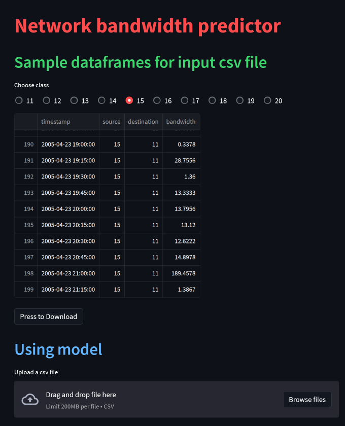
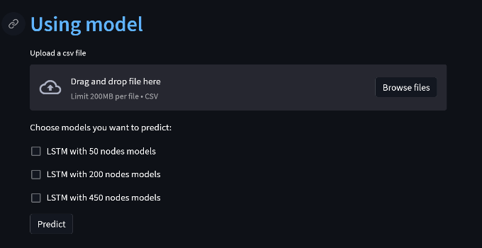
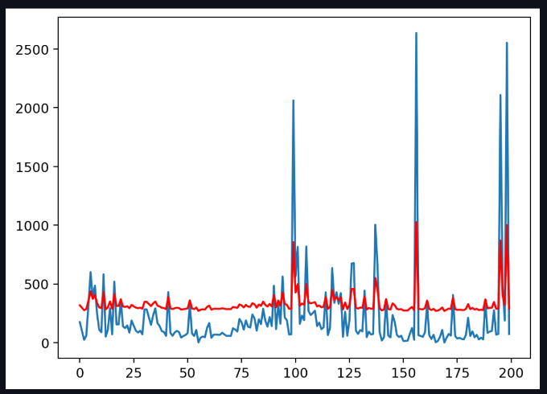

# About dataset

## <span style="color:red">TOTEM dataset</span>

[Dataset](http://totem.run.montefiore.ulg.ac.be/files/data/traffic-matrices-anonymized-v2.tar.bz2) provide traffic matrices from a transit network, in a TOTEM compliant XML format. <br>
It has computed one traffic matrix per 15 minutes bin for a period of about 4 months <br>
(the units used for the matrices are kbps). More details about how the matrices were generated <br>
can be found in the editorial [CCR paper](http://www.info.ucl.ac.be/~suh/papers/traffic-matrices.pdf) mentioned below.

Please refer to the following paper when using the traffic matrices for any publication: <br>
S. Uhlig, B. Quoitin, S. Balon and J. Lepropre. Providing public intradomain traffic matrices <br>
to the research community. ACM SIGCOMM Computer Communication Review, 36(1), January 2006.

Note that all router IDs and absolute time information have been anonymized in the publicly available dataset. <br>
For access to the non-public dataset please contact [Steve Uhlig](suh@info.ucl.ac.be).

# <span style="color:green">Models</span>

Datasets is trained with tensorflow API. GPU is recommended for this datasets. Because it takes a lot of time on cpu.

# Installation

1. Install python

   - requirement version 3.x

2. Create virtual environment

   - pip install virtualenv
   - python -m venv {name of virtual environment}
   - activate it<br>
   - 1. On Windows: C:/path to your env/Scripts/activate
   - 2. On Linux: path to your env/bin/activate

3. `pip install -r requirements.txt`

### Usage of [Streamlit](https://github.com/streamlit/streamlit.git)

```
streamlit run stream.py
```

The result is as follows:

<a></a>

You can select the model you want to use by:

<a></a>

Result of the model is shown as floows:

<a></a>

## Features

### Deep Learning

- we have deep neural network with [tensorflow](https://github.com/tensorflow/tensorflow.git)
